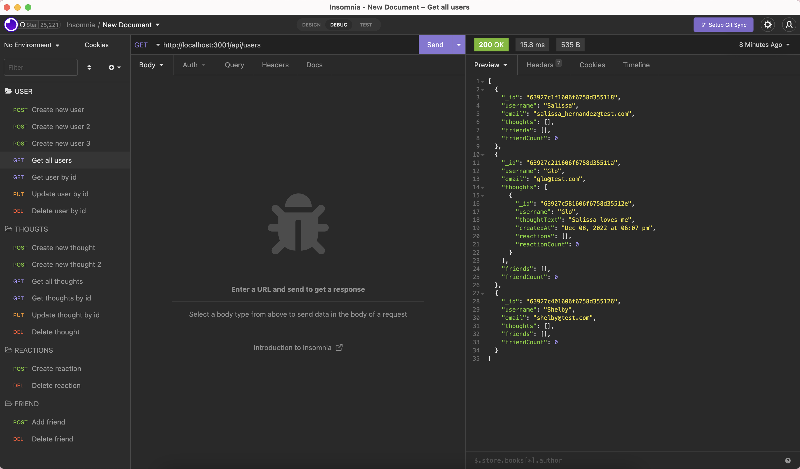
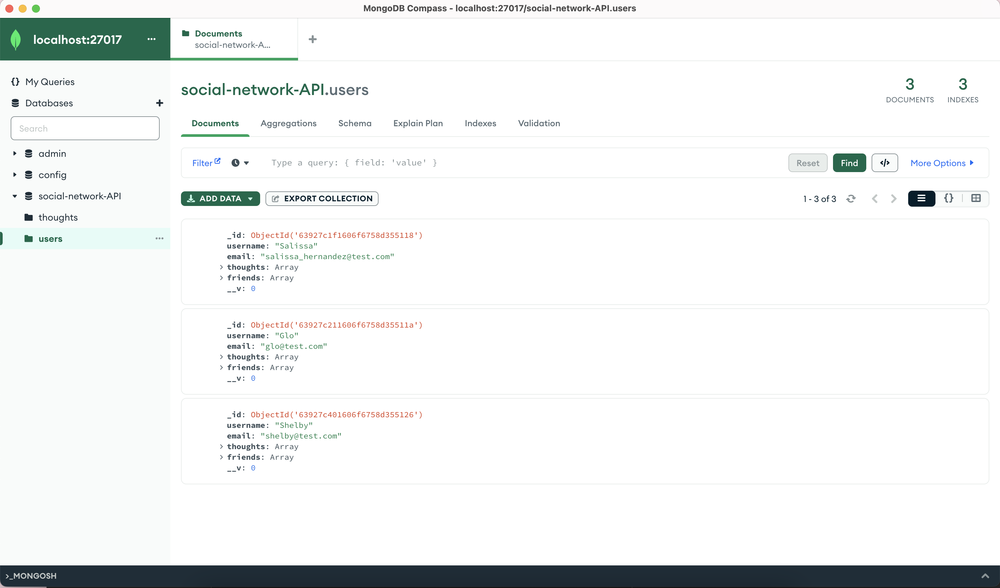

# Social Network
Social Media startup that handles large amounts of unstructured data.

# Objectives
To create an API:
- That uses a NoSQL database
- Has models synced to MongoDB database
- Users and thoughts are displayed in a JSON format through the API GET routes 
- That successfully creates, updates, and deletes users and thoughts in the database through the API POST, PUT, and DELETE routes
- That successfully creates and deletse reactions to thoughts and add and remove friends to a user’s friend list through API POST and DELETE routes 

# Video Walkthrough
 https://drive.google.com/file/d/1P9VMNh9dhCQOiqyNmxEXuIxCT755DbDV/view

 # Usage
 - In your terminal run `npm run start` to start the application
 - In Insomnia run the `get, post, put and delete commands`

 # Images
 # Insomnia
 

 # Compass
 